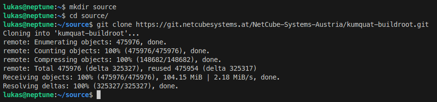
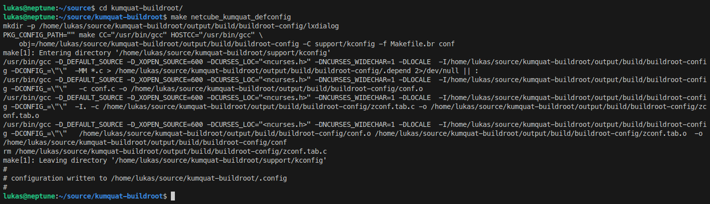
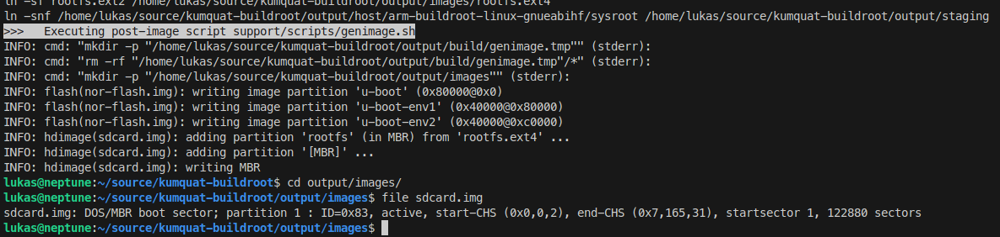
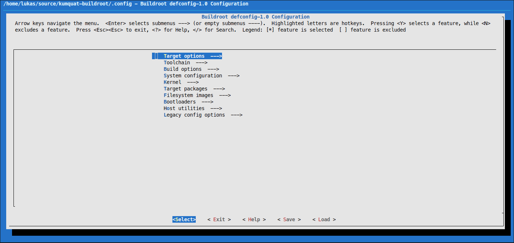

# Buildroot Setup

## Introduction
In this section, we'll guide you through the process of cloning the Git repository containing the source for Buildroot and creating your first build for the Kumquat board. Follow these steps to customize and build your own Linux image for your Kumquat board.

## Prerequisites
Before proceeding, ensure that you have:

- A computer running a Debian-based distribution or Windows Subsystem for Linux 2 (WSL2) with a Debian-based distro.
- Installed the following packages using apt:

```shell
sudo apt update
sudo apt install -y sed make binutils build-essential diffutils gcc g++ bash patch gzip bzip2 perl tar cpio unzip rsync file bc findutils wget git
```

## Step 1: Clone Buildroot Repository
1. Open a terminal on your computer.
2. Clone the Buildroot repository by running the following command:
```shell
git clone https://git.netcubesystems.at/NetCube-Systems-Austria/kumquat-buildroot.git
```



## Step 2: Configure the Build
1. Change directory into the newly cloned Git folder:
```shell
cd kumquat-buildroot
```

2. Configure the Buildroot project for the Kumquat board by running:
```shell
make netcube_kumquat_defconfig
```



## Step 3: Build the Image
1. Start the build process by running:
```shell
make
```

2. The build process will take some time (could be a few hours depending on your system's performance). Monitor the progress in the terminal.

## Step 4: Obtain the Built Image
1. Once the build finishes, navigate to the output/images folder within the Buildroot directory.
2. You will find a new file named "sdcard.img". This is your custom-built Linux image for the Kumquat board.



## Step 5: Customize the Build (Optional)
1. If you wish to customize the Buildroot installation, run:
```shell
make menuconfig
```



2. Make your desired changes in the configuration menu.
3. After making changes, save the configuration and run `make` again to create a new "sdcard.img".

## Conclusion
Congratulations! You have successfully cloned the Buildroot repository, configured your first build for the Kumquat board, and created a custom Linux image. Feel free to explore further customization options using Buildroot's documentation available at [Buildroot Manual](https://buildroot.org/downloads/manual/manual.html).
